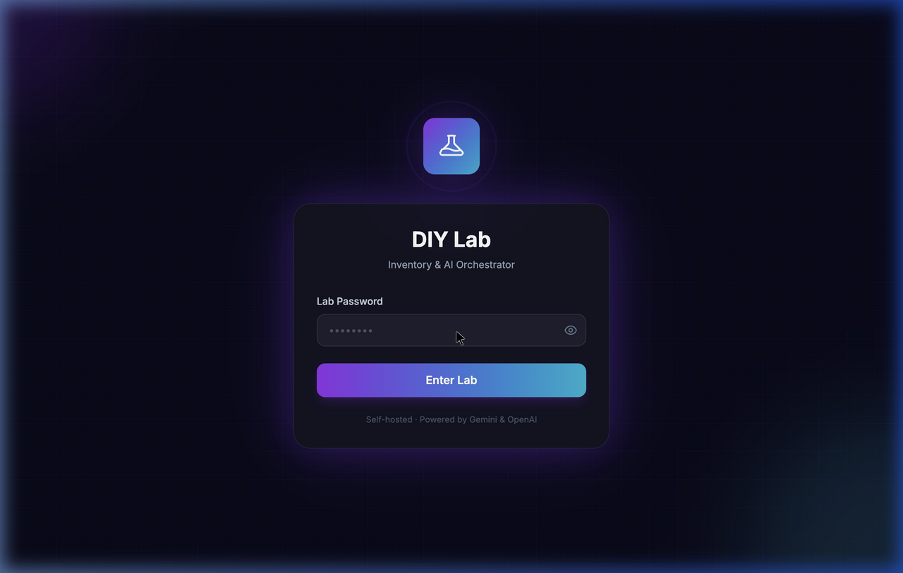
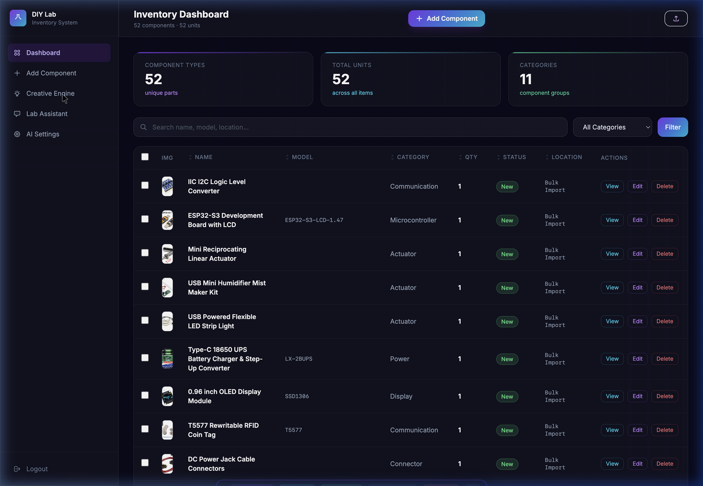
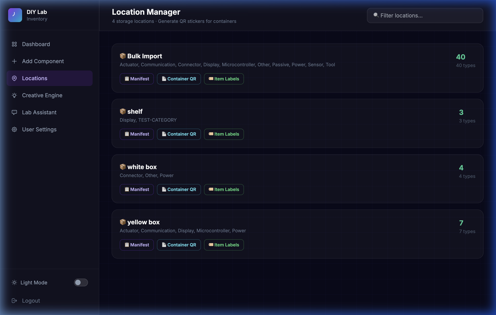
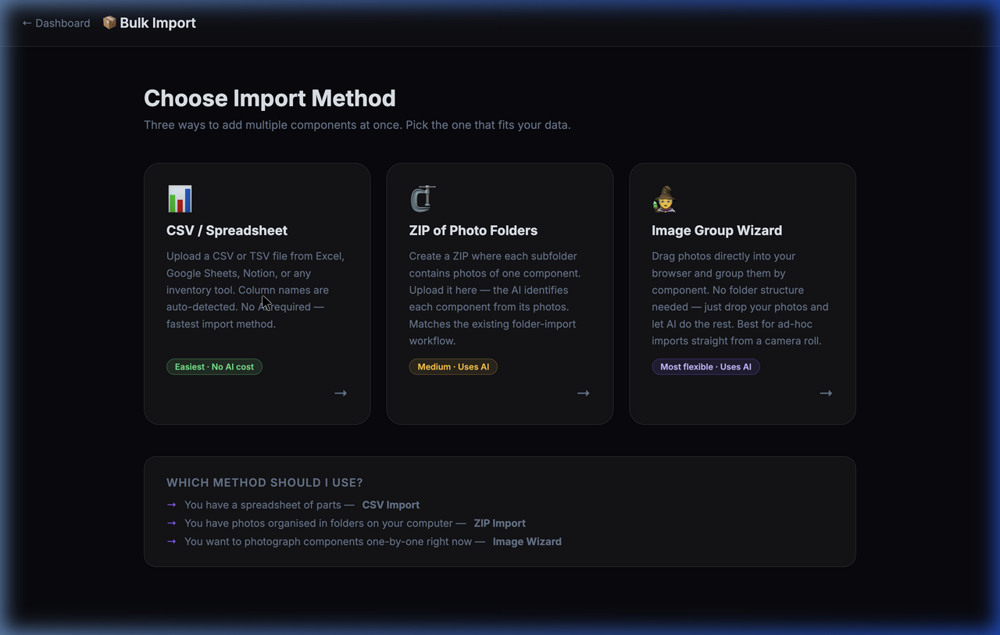
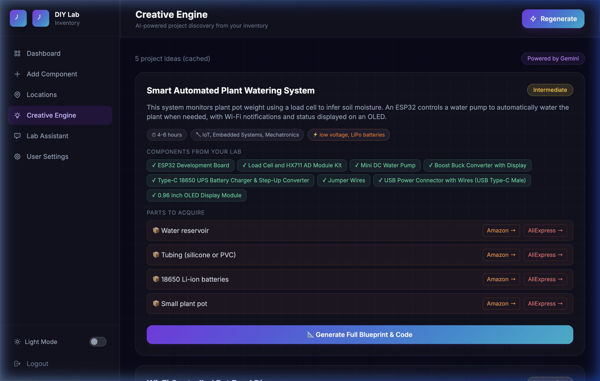
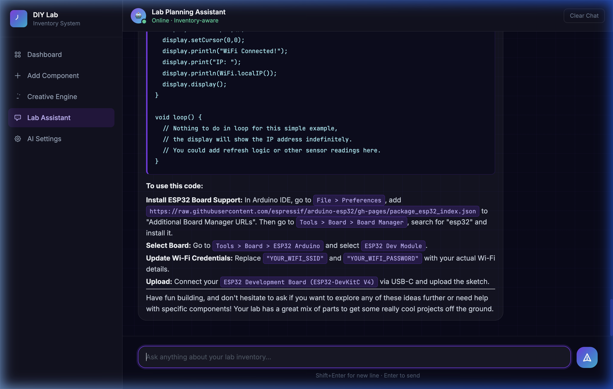
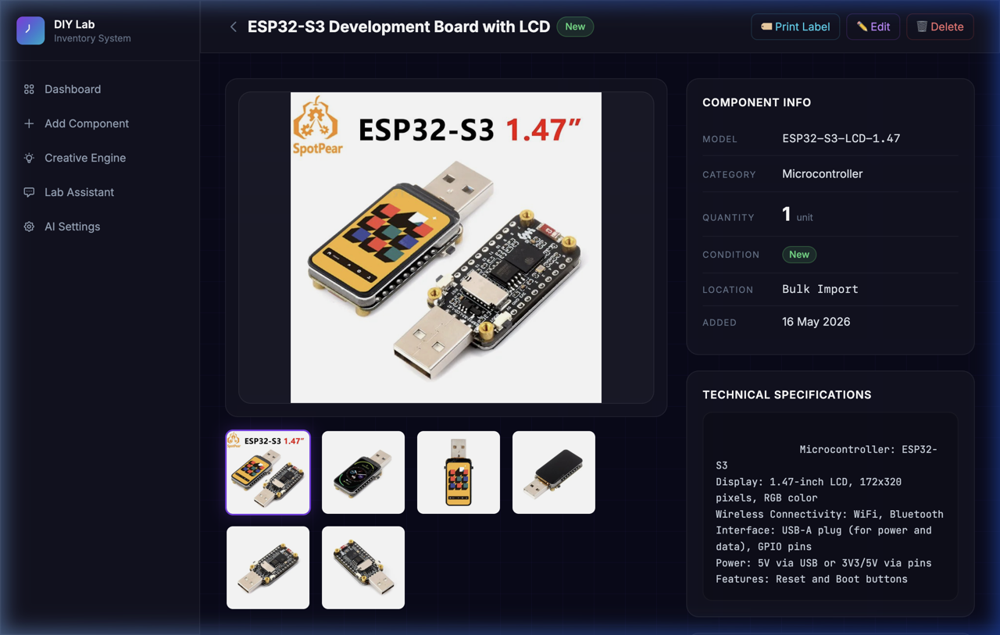

# 🧪 DIY Lab Inventory & AI Orchestrator

> A self-hosted, AI-powered hardware inventory system for makers, hobbyists, and electronics enthusiasts. Track your components, identify parts from photos, and let AI generate project ideas from your actual stock.


---

## 📖 Table of Contents

- [Overview](#-overview)
- [Features](#-features)
- [Screenshots](#-screenshots)
- [Tech Stack](#-tech-stack)
- [Project Structure](#-project-structure)
- [Installation](#-installation)
  - [macOS (Homebrew)](#macos-homebrew)
  - [Linux / Ubuntu](#linux--ubuntu)
  - [Windows (XAMPP)](#windows-xampp)
- [Database Setup](#-database-setup)
- [Getting API Keys](#-getting-api-keys)
- [Running the App](#-running-the-app)
- [Usage Guide](#-usage-guide)
- [Mobile Support](#-mobile-support)
- [Deployment to a Live Server](#-deployment-to-a-live-server)
- [Security Notes](#-security-notes)
- [File Map](#-file-map)
- [Troubleshooting](#-troubleshooting)
- [Contributing](#-contributing)

---

## 🔬 Overview

The **DIY Lab Inventory & AI Orchestrator** is a lightweight, self-hosted web application that turns the chaos of a maker's lab into a structured, searchable, AI-enhanced database.

Instead of spreadsheets or sticky notes, you get:
- A **visual inventory dashboard** with photos, specs, and location tracking
- **AI auto-identification** — drop a photo of a component and the AI fills in the name, model, and specs
- A **Creative Engine** that analyses your actual stock and suggests 5 buildable projects with shopping links for missing parts
- **AI-generated blueprints** with step-by-step wiring guides and production-ready code
- A **Lab Assistant chatbot** that knows exactly what components you own

Everything runs locally. No cloud subscriptions, no monthly fees — just PHP, MySQL, and your own AI API key.

---

## ✨ Features

| Feature | Description |
|---------|-------------|
| 🔐 **Secure Login** | Password-protected gate. No user accounts needed for a personal lab. |
| 📦 **Inventory CRUD** | Add, edit, delete components with name, model, category, quantity, condition, specs, location, purchase price, and product/datasheet URLs. |
| 📸 **Multi-Angle Image Upload** | Upload several photos per component. Images are **automatically resized and compressed** on upload (max 1200px, ~100–200 KB). Two versions are stored: a full-res viewer image and a small thumbnail. Saves ~98% storage vs raw phone photos. |
| 🤖 **AI Auto-Identify** | Drag-and-drop photos → AI returns a structured JSON with `name`, `model`, `category`, and `specs`. Fields are auto-filled. |
| 📂 **Flexible Bulk Import** | Three browser-based import methods — no server access needed: **CSV/Spreadsheet** (auto-maps columns, optional AI enrichment via Product URL), **ZIP upload** (flat ZIP = one component; subfolder ZIP = many components; AI identifies from photos), **Image Group Wizard** (drag photos, declare groups, AI identifies each). |
| 🏷️ **Location Manager** | Dedicated `locations.php` dashboard groups all components by location. Shows per-location stats, expandable item lists, and generates a **Container QR sticker** (offline-readable) or a full **printable manifest** for each location. |
| 📄 **QR Code Labels** | Offline-ready QR stickers for individual components (print from item detail or bulk-select on dashboard). QR payload contains Name, Model, Category, Qty, Location as plain text — readable without a network connection. URL appended for one-tap browser open when online. |
| 🖨️ **Print Manifest** | Per-container A4 printout with all items, quantities, and a **Verified ☐** checkbox column for physical stock audits. Strict black-on-white CSS — works on any B&W printer. |
| 🔃 **Column Sorting** | Click any column header (Name, Model, Category, Qty, Status, Location) to sort ascending or descending. Active column highlights in purple. Preserves active search and filter. |
| ☑️ **Bulk Actions** | Select multiple items with checkboxes (per-row + select-all). A floating action bar appears with: **Category change**, **Status change**, **Location change**, **Export CSV**, **Print Labels**, and **Delete** (with image cleanup). |
| 🔗 **Product Enrichment** | Attach a product URL or datasheet URL to any component. Click "Enrich from Web" to scrape and cache the page content. This documentation is automatically injected into AI prompts for richer, more accurate suggestions. |
| 💡 **Creative Engine** | Click **Brainstorm Projects** to have the AI analyse your entire inventory and return 5 tailored project ideas with complexity, duration, skill domain, and missing-part shopping links. Results are **cached in the DB** — navigating away and returning shows the last ideas instantly at zero API cost. Click **Regenerate** any time for fresh suggestions. |
| 📐 **Project Blueprints** | One-click generation of a full technical guide (wiring, BOM, and firmware code) for any suggested project. |
| 💬 **Lab Assistant Chat** | A context-aware chat interface. The AI knows your inventory — including cached product documentation — and answers questions like "what can I build with my extra LEDs?". |
| ⚙️ **User Settings** | A comprehensive settings hub with four ordered sections: **Language** selector, **Personalization** (Lab Name, Tag Line, Mini Tag Line, Logo), **Change Password** (bcrypt-secured), and **AI Configuration** (provider + API key). All settings are persisted in the database — no code editing required. |
| 🎨 **Lab Personalization** | Customise your lab's identity from the UI: set a **Lab Name**, **Tag Line** (login screen subtitle), **Mini Tag Line** (sidebar label), and **Logo** (upload a file or paste a URL). Uploaded logos are centre-cropped to a square and resized to 256×256 px by PHP GD, then stored in `uploads/logo/`. Changes propagate instantly to all pages including the login gate. Default branding falls back to the built-in gradient icon. |
| 🔑 **Secure Password Management** | Change the lab password directly from User Settings — no file editing required. The current password is verified before accepting a change; the new password is hashed with **`PASSWORD_BCRYPT`** and stored in the database. A live "passwords match" hint guides the user during entry. |
| 🌗 **Light / Dark Theme** | Toggle between dark (default) and light mode via the sidebar switch. Preference is persisted in `localStorage` across sessions and page reloads — survives logout. All colours meet **WCAG 2.1 AA** contrast requirements in both themes. |
| 🌍 **Multi-Language UI** | Full internationalisation (i18n) across all pages — switch between **English 🇬🇧**, **Hebrew 🇮🇱 (RTL)**, and **Spanish 🇪🇸** from the Settings page. Language persists in `localStorage`. Hebrew activates complete RTL layout mirroring (sidebar, margins, flex order, text alignment). Add new languages with a single JSON file. |
| 📱 **Mobile Responsive** | Full hamburger-menu sidebar, card-based inventory view (with checkboxes for bulk selection), and adaptive layouts for phones and tablets. |

---

## 📸 Screenshots

> The app uses a dark glassmorphism aesthetic with an electric purple + cyan gradient palette.

> Screenshots taken from a live install with 52 components across 3 storage locations.

### Login


### Inventory Dashboard


### Location Manager


### Bulk Import Hub


### Creative Engine — Generated Project Ideas


### Lab Assistant Chat


### Item Detail View


---

## 🛠 Tech Stack

| Layer | Technology |
|-------|-----------|
| **Backend** | PHP 8.0+ (vanilla, no framework) |
| **Database** | MySQL 8.0+ / MariaDB |
| **Frontend** | HTML5, Vanilla JavaScript, Tailwind CSS v3 (pre-built, local) + custom `assets/app.css` (theme tokens, light-mode overrides, WCAG 2.1 AA contrast) |
| **Fonts** | Google Fonts — Inter, JetBrains Mono |
| **Markdown** | marked.js (CDN) — for blueprint rendering |
| **AI Providers** | Google Gemini 2.5 Flash · OpenAI GPT-4o |
| **Image Storage** | Local filesystem (`uploads/` directory) — component photos auto-resized to 1200px max; logo uploads stored in `uploads/logo/` as 256×256 px JPEG |
| **Image Processing** | PHP GD (built-in) — JPEG, PNG, WebP, GIF input; JPEG output. `imagedestroy()` removed for PHP 8.5 compatibility (no-op since 8.0). |
| **HTTP Client** | PHP cURL (built-in) |

---

## 📁 Project Structure

diy-inventory/
├── index.php                    # Login / password gate
├── logout.php                   # Session teardown + redirect to login
├── dashboard.php                # Main inventory dashboard (sorting, bulk actions, print labels)
├── add_item.php                 # Add & edit components (AI identify + AJAX submit + enrichment)
├── item_details.php             # Single component detail + image gallery + print label button
├── delete_item.php              # Image-aware deletion handler
├── bulk_action.php              # Bulk operations handler (category/status/location/delete/CSV)
├── bulk_import.php              # Bulk Import Hub — choose CSV, ZIP, or Image Wizard
├── bulk_import_csv.php          # CSV/TSV import — column auto-map + optional URL enrichment
├── bulk_import_zip.php          # ZIP upload — flat ZIP or subfolder-per-component, AI pipeline
├── bulk_import_folder.php       # Folder-based import — browse a local folder structure via the browser
├── bulk_import_wizard.php       # Image Group Wizard — drag photos, group, AI identify
├── bulk_import_wizard_worker.php# Wizard AI worker — receives images, calls Gemini, inserts item
├── bulk_import_worker.php       # Legacy folder worker — processes ONE folder per call
├── locations.php                # Location Manager — grouped view, QR stickers, manifest links
├── container_manifest.php       # Per-location manifest — live table + B&W printable sheet
├── print_labels.php             # Bulk QR label printer — small/medium/large Avery sizes
├── enrich_api.php               # Web scraper — fetches & caches product documentation
├── projects.php                 # Creative Engine — AI project discovery (cached in DB)
├── project_blueprint.php        # AI-generated build guides
├── chat.php                     # Lab Assistant chat UI
├── chat_api.php                 # Chat backend — injects inventory + enrichment context
├── settings.php                 # User Settings hub — Language, Personalization (logo upload), Change Password, AI config
├── site_config.php              # Shared branding loader — fetches lab_name, lab_tagline, lab_mini_tagline, lab_logo_url once per request
├── identify_api.php             # AI vision endpoint (used by add_item.php)
├── ai_helper.php                # Central AI proxy — call_ai_api() + enrichment context builder
├── image_helper.php             # Image processing — imagecreatefromstring, resize full+thumb (PHP 8.5 compatible)
├── db.php                       # PDO database connection (git-ignored, copy from db.php.example)
├── db.php.example               # Safe credential template — copy to db.php and fill in your values
├── schema.sql                   # Database schema + seed data (incl. lab_name, lab_tagline, lab_mini_tagline, lab_logo_url, lab_password)
├── php.ini                      # PHP upload/memory limits for built-in server
├── .htaccess                    # PHP limits for Apache deployments
├── tailwind.config.js           # Tailwind CSS content scan config
├── package.json                 # npm scripts: build:css, watch:css, validate:i18n
├── CHANGELOG.md                 # Changelog — all releases and unreleased work
├── CONTRIBUTING.md              # Contributor guide — setup, PR process, code style
├── SECURITY.md                  # Security policy and vulnerability reporting
├── DEPLOYMENT.md                # Full deployment guide — VPS, shared hosting, migration
├── assets/app.css               # Global stylesheet — Tailwind base + theme tokens + WCAG light-mode + RTL overrides
├── assets/input.css             # Tailwind source file — compiled to app.css via npm run build:css
├── assets/i18n.js               # Localisation engine — async locale loader, t(), RTL sidebar patching, BiDi isolation
├── assets/locales/en.json       # English locale — 142 translation keys across 9 namespaces
├── assets/locales/he.json       # Hebrew locale — 142 keys, full RTL support
├── assets/locales/es.json       # Spanish locale — 142 keys
├── contrast_audit.js            # Dev utility — audits all page colours against WCAG 2.1 AA ratios
├── tests/pre_merge_check.js     # Pre-merge test suite — 47 automated checks covering i18n, RTL CSS, locale parity
├── tests/user_settings_check.js # User Settings QA suite — 109 automated checks: logo upload, personalization fields, bcrypt security, dynamic branding, logout endpoint, HTTP smoke tests
├── uploads/                     # Component photos (auto-created, git-ignored)
├── uploads/logo/                # Lab logo uploads (auto-created, git-ignored)
└── docs/                        # Original design & phase documentation
```

> **Single-File Mandate:** Every page contains its own HTML, CSS, and JS in one file to keep the architecture slim and portable.

---

## 🚀 Installation

### macOS (Homebrew)

This is the recommended method for local development on macOS.

**1. Install Homebrew** (if not already installed)
```bash
/bin/bash -c "$(curl -fsSL https://raw.githubusercontent.com/Homebrew/install/HEAD/install.sh)"
```

**2. Install PHP and MySQL**
```bash
brew install php mysql
```

**3. Start MySQL**
```bash
brew services start mysql
```

**4. Secure MySQL** (optional but recommended — sets a root password)
```bash
mysql_secure_installation
```

**5. Clone the repository**
```bash
git clone https://github.com/YOUR_USERNAME/diy-inventory.git
cd diy-inventory
```

**6. Create the uploads directory**
```bash
mkdir -p uploads
chmod 755 uploads
```

---

### Linux / Ubuntu

```bash
# Install dependencies
sudo apt update
sudo apt install php php-mysql php-curl php-json mysql-server -y

# Start MySQL
sudo systemctl start mysql
sudo systemctl enable mysql

# Secure MySQL
sudo mysql_secure_installation

# Clone repo
git clone https://github.com/YOUR_USERNAME/diy-inventory.git
cd diy-inventory
mkdir -p uploads && chmod 755 uploads
```

---

### Windows (XAMPP)

1. Download and install [XAMPP](https://www.apachefriends.org/) (includes PHP + MySQL + phpMyAdmin).
2. Clone or download this repo into `C:\xampp\htdocs\diy-inventory\`.
3. Start **Apache** and **MySQL** from the XAMPP Control Panel.
4. Create the `uploads/` folder inside the project directory.
5. Access the app at `http://localhost/diy-inventory/`.

---

## 🗄 Database Setup

**1. Log into MySQL**
```bash
# macOS / Linux
mysql -u root -p

# If no password was set (fresh install)
mysql -u root
```

**2. Create the database**
```sql
CREATE DATABASE diy_lab_db CHARACTER SET utf8mb4 COLLATE utf8mb4_unicode_ci;
USE diy_lab_db;
```

**3. Apply the schema**
```bash
# From the project root
mysql -u root -p diy_lab_db < schema.sql
```

Or paste the contents of `schema.sql` directly into phpMyAdmin's SQL tab.

This creates two tables:

| Table | Purpose |
|-------|---------|
| `inventory` | All components — name, model, category, quantity, status, specs, image paths, location, product URL, datasheet URL, notes, purchase price, and cached enrichment data |
| `settings` | Key-value store for all configuration — AI provider, API key, lab branding (`lab_name`, `lab_tagline`, `lab_mini_tagline`, `lab_logo_url`), and the bcrypt-hashed login password (`lab_password`) |

**Personalization keys seeded by default:**

| Key | Default value |
|-----|---------------|
| `lab_name` | `DIY Lab` |
| `lab_tagline` | `Inventory & AI Orchestrator` |
| `lab_mini_tagline` | `Inventory System` |
| `lab_logo_url` | *(empty — uses built-in gradient icon)* |
| `lab_password` | *(empty — defaults to `1234` until changed via UI)* |

**4. Verify database credentials in `db.php`**

The default credentials are:
```php
$host = '127.0.0.1';
$db   = 'diy_lab_db';
$user = 'root';
$pass = '';          // Change this if you set a MySQL root password
```

If you set a MySQL root password during `mysql_secure_installation`, update `$pass` accordingly.

---

## 🔑 Getting API Keys

The app needs **one** API key to power all AI features. You can choose between **Google Gemini** (recommended) or **OpenAI GPT-4o**.

### Option A — Google Gemini (Recommended)

The app uses **Gemini 2.5 Flash**, which supports vision (image analysis) and text.

#### Free Tier (AI Studio key)
Good for personal use and testing.

1. Go to **[Google AI Studio](https://aistudio.google.com/app/apikey)**
2. Sign in with your Google account
3. Click **"Create API Key"** and select your project
4. Copy the key (starts with `AIza...`)

> **Free limits:** ~1,500 requests/day. Sufficient for personal lab use. Quota resets daily at midnight Pacific time.

#### Paid Tier (Google Cloud Console key)
Required if you hit free-tier limits or need higher throughput.

1. Go to **[Google Cloud Console → APIs & Services → Credentials](https://console.cloud.google.com/apis/credentials)**
2. Ensure **billing is enabled** on the project (check via Billing menu)
3. Enable the **Gemini API** for the project:
   - Go to **APIs & Services → Library** → search **"Gemini API"** → click **Enable**
4. Click **`+ Create Credentials` → `API key`**
5. In the restrictions dropdown, select **Gemini API**
6. Copy the key

> **Important:** Both free and paid keys look identical (`AIza...`). The difference is the Google Cloud **project** they belong to and whether billing is enabled on it. A key from a project without billing always hits free-tier limits.

> **Model note:** This app uses `gemini-2.5-flash` via the `v1beta` endpoint. Older models (`gemini-1.5-flash`, `gemini-2.0-flash`) may return 404 depending on your project's API access. If you see a 404 error, your key is working but the model isn't available — the app is already configured for the correct model.

### Option B — OpenAI GPT-4o

GPT-4o also supports vision and text. This is a paid service.

1. Go to **[OpenAI Platform](https://platform.openai.com/api-keys)**
2. Create an account or log in
3. Navigate to **API Keys → Create new secret key**
4. Copy the key (starts with `sk-...`)

> **Cost:** GPT-4o charges per token. A typical identify + project session costs under $0.05. Add $5–$10 credit to start.

### Saving Your API Key

Once the app is running:
1. Open `http://localhost:8080/settings.php`
2. Scroll to the **AI Configuration** section (section 4)
3. Select **Gemini** or **OpenAI**
4. Paste your key in the **API Key** field
5. Click **Save Configuration**

The key is stored in the `settings` database table — never hardcoded in files.

---

## ▶️ Running the App

### Start the PHP built-in server

The project includes a `php.ini` that raises upload limits for large phone photos. Always start the server using the `-c` flag to apply it:

```bash
# From the project root (recommended — applies php.ini with raised limits)
php -c php.ini -S localhost:8080

# Make it accessible from phones on the same Wi-Fi network
php -c php.ini -S 0.0.0.0:8080
```

> **CSS rebuild:** If you add new Tailwind utility classes to a PHP file, regenerate `assets/app.css`:
> ```bash
> npm run build:css
> ```
> Or watch for changes during development: `npm run watch:css`

> **i18n validation:** Before committing new UI elements, verify all locale files have 100% key coverage:
> ```bash
> npm run validate:i18n
> ```

Open your browser at: **`http://localhost:8080`**

**Default password:** `1234`

> To change the password, go to **User Settings → Change Lab Password**. Enter the current password and choose a new one (minimum 6 characters). The new password is stored as a **bcrypt hash** in the database — no file editing required.

### Access from a phone or tablet (same Wi-Fi)

1. Find your Mac's local IP: `ipconfig getifaddr en0`
2. Start the server bound to all interfaces: `php -c php.ini -S 0.0.0.0:8080`
3. On your phone's browser, navigate to `http://<YOUR-MAC-IP>:8080`

> If connection is refused, check macOS Firewall (**System Settings → Network → Firewall → Options**) and allow `php`.

### Stop the server
Press `Ctrl + C` in the terminal.

### Auto-start on macOS restart

If you want MySQL to start automatically:
```bash
brew services start mysql
```

---

## 📋 Usage Guide

### 1. Add your first component

- Click **"Add Component"** in the sidebar
- **Option A (AI):** Drop one or more photos of the part into the drag-zone → click **"Auto-Identify with AI"** → review auto-filled fields → click Save
- **Option B (Manual):** Fill in name, model, category, quantity, condition, specs, and bin location → click Save

### 2. Browse your inventory

- The **Dashboard** shows all components in a searchable, filterable table
- Click any component name to open its **detail page** with the full image gallery
- Use the search bar to find parts by name, model, specs, or physical location

### 3. Discover projects

- Click **"Creative Engine"** in the sidebar
- Click **"Brainstorm Projects"** — a loading overlay shows while the AI works (15–40 s)
- The AI analyses your entire inventory and returns 5 tailored project ideas with:
  - Complexity level and estimated build time
  - Components used from your stock
  - Missing parts with Amazon & AliExpress search links
- Click **"Generate Blueprint"** on any project for full wiring instructions and firmware code
- Results are **saved automatically** — if you navigate away and return, the last ideas load instantly (no API call). The header shows when they were generated and offers a **↺ Regenerate** button.

### 4. Chat with your Lab Assistant

- Click **"Lab Assistant"** in the sidebar
- Ask anything: *"What can I build with my ESP32 and OLED display?"*, *"Show me all my sensors"*, *"I want to make a gift for my kid"*
- The assistant has full context of your current inventory

### 5. Bulk-import components

Open **Bulk Import** from the dashboard header. Three methods are available:

#### 📊 CSV / Spreadsheet Import
1. Export your parts list from Google Sheets, Excel, Notion, or any tool as a `.csv` file
2. Upload on the **CSV Import** page — the delimiter is auto-detected
3. Column headers are auto-mapped (30+ common aliases like `qty`, `part number`, `bin`, `shop url`, etc.)
4. Adjust any unrecognised columns using the dropdown mapping UI
5. Optionally check **"Auto-enrich via Product URL"** — inserts items then calls the AI enrichment endpoint for each item that has a URL
6. Click **Import to Inventory** — results appear with live enrichment status

#### 🗜️ ZIP Upload
1. Create a ZIP file on your computer
   - **Flat ZIP** (one component): put all photos directly in the ZIP root → named after the ZIP file
   - **Subfolder ZIP** (many components): one subfolder per component, each with photos and an optional `description.txt`
2. Upload on the **ZIP Import** page
3. The ZIP is extracted and validated (path traversal protection), then the AI import pipeline runs

#### 🧙 Image Group Wizard
1. Open the **Image Wizard** page
2. Drag a batch of photos onto the drop zone — each batch becomes one component group
3. Optionally type a name hint (e.g. "servo motor") to improve AI accuracy — leave blank for full AI identification
4. Repeat for as many components as needed
5. Click **"🤖 Import All via AI"** — groups are processed sequentially with a 3s rate-limit buffer
6. Each card updates live: ⏳ → ✅ with a "View →" link

> [!TIP]
> Items that fail AI identification are still inserted using the folder/ZIP/hint name. Refine them later via the Edit page or the **🌐 Enrich from Web** button.

### 6. Manage locations & generate QR labels

#### Location Manager (`locations.php`)
- Click **"📍 Locations"** in the dashboard sidebar
- All components are grouped by their `location` field
- Each location card shows item count, total units, and category breakdown
- Click **"🏷️ QR Sticker"** to generate an offline-readable QR code for any container
- Click **"📄 Manifest"** to open the full container manifest page

#### Container Manifest (`container_manifest.php`)
- Shows a live table of all items in a location
- QR payload is **self-contained** (Name / Model / Category / Qty / Location as plain text) — scannable with no network connection
- URL appended to payload for one-tap browser open when online
- Click **"🖨️ Print Manifest"** for a clean A4 printout with a **Verified ☐** checkbox column for physical audits

#### Component Labels (`print_labels.php`)
- On any item detail page, click **"🏷️ Print Label"** for a single label
- On the dashboard, select multiple items and click **"🏷️ Print Labels"** in the bulk action bar
- Choose label size: Small (Avery 62×29 mm), Medium (Avery 99×57 mm), Large (Avery 99×93 mm)
- Labels print with QR code + component name, model, category, qty, and location

### 7. Enrich component data from the web

- Open any component's detail page → click **"🌐 Enrich from Web"**
- The server fetches and caches plain text from the saved `product_url` / `datasheet_url`
- Cached text is automatically injected into all future AI prompts (Lab Chat, Creative Engine, Blueprints) for that component

---

## 📱 Mobile Support

The app is fully responsive and optimised for phones and tablets:

- **Hamburger menu** (☰) replaces the sidebar on screens smaller than 1024px
- The sidebar slides in as a **drawer overlay** with a dark backdrop
- The inventory **table collapses into cards** on mobile screens
- All forms stack to **single-column layouts** on small screens
- The **chat interface** fills the full viewport on mobile
- Headers show abbreviated labels (e.g., "Add" instead of "Add Component") to save space

---

## 🌐 Deployment to a Live Server

Full deployment instructions are in **[DEPLOYMENT.md](DEPLOYMENT.md)**.

Two complete paths are covered:

### 🆕 Path A — Fresh Install on a Web Server
Set up a brand-new Ubuntu VPS from scratch:
1. Install Apache, MySQL, PHP
2. Create database and dedicated app user
3. Upload app files via SCP or GitHub clone
4. Configure Apache Virtual Host
5. Enable HTTPS with Let’s Encrypt (free)
6. Raise PHP upload limits
7. Save your API key via the UI

### 🚚 Path B — Migrate from Local to Web Server
Move your existing local instance (with all data and photos) to a live server:
1. Export local MySQL database with `mysqldump`
2. Archive `uploads/` with `tar`
3. Transfer files via `rsync` / `scp`
4. Import data and photos on the server
5. Update `db.php` with server credentials
6. Set file permissions for Apache
7. Configure Virtual Host + HTTPS

### 🖥 Path C — Shared Hosting (DirectAdmin / cPanel)
Deploy on a regular hosting account — no root access, everything via panel UI and FTP:
1. **Set PHP to 8.1+** via "PHP Settings" in DirectAdmin (⚠️ PHP 7.x is not supported)
2. Create a MySQL database via "MySQL Management" — note the prefixed DB name
3. Import `schema.sql` via **phpMyAdmin**
4. Upload files via **FTP** (FileZilla / Cyberduck) to `public_html/`
5. Edit `db.php` with the prefixed database name and credentials
6. Verify `.htaccess` overrides PHP upload limits to 25M
7. Enable free **Let's Encrypt SSL** from the panel
8. Save your API key via `settings.php`

> ⚠️ **DirectAdmin note:** The database name and username are automatically prefixed with your account name (e.g. `myaccount_diy_lab_db`). Always copy the exact values from the panel.

### Recommended VPS Providers

| Provider | Entry Price | Notes |
|----------|------------|-------|
| [DigitalOcean](https://digitalocean.com) | $6/month | Simple UI, great docs |
| [Hetzner](https://hetzner.com) | €4/month | Best value in Europe |
| [Linode](https://linode.com) | $5/month | Reliable, good support |
| [Vultr](https://vultr.com) | $6/month | Fast global CDN |

> See **[DEPLOYMENT.md](DEPLOYMENT.md)** for the complete step-by-step guide including security hardening, firewall setup, automated backups, and a troubleshooting table.

---

## 🔒 Security Notes

| Risk | Mitigation |
|------|-----------|
| Weak password | Change the default `1234` via **User Settings → Change Lab Password** — no file editing needed |
| Password storage | Passwords are hashed with **`PASSWORD_BCRYPT`** via PHP's `password_hash()` and verified with `password_verify()` — never stored as plaintext |
| API key exposure | Keys are stored in the DB, not in files. Never commit `db.php` with credentials to a public repo. |
| File upload abuse | Image MIME types verified; all uploads are re-encoded through PHP GD, stripping any embedded malicious data. |
| SQL injection | All database queries use **PDO prepared statements** throughout. |
| Session hijacking | Sessions are PHP-native. Use HTTPS in production to prevent interception. |

> **Recommended:** Add `db.php` and any `.env` files to your `.gitignore` before pushing to GitHub.

```gitignore
# .gitignore
db.php
uploads/
.DS_Store
*.log
```

---

## 🗂 File Map

| File | Role |
|------|------|
| `index.php` | Login page with session-based password gate |
| `db.php` | PDO connection wrapper — required by all pages |
| `ai_helper.php` | Central AI proxy: `call_ai_api($prompt, $images)` + `build_enrichment_context()` — fetches key from DB, handles Gemini & OpenAI |
| `dashboard.php` | Inventory list with search, filter, column sorting, bulk actions (checkboxes + floating bar), and stats |
| `add_item.php` | Add/Edit form + AI Auto-Identify drag-drop zone + product URL/datasheet/notes/price fields |
| `image_helper.php` | `process_image()` — resizes uploads to `full_*.jpg` (1200px/q85) + `thumb_*.jpg` (400px/q80) using PHP GD |
| `item_details.php` | Single component view with interactive image gallery and "Enrich from Web" button |
| `delete_item.php` | Deletes DB record + physical image files |
| `bulk_action.php` | Handles bulk POST actions: `set_category`, `set_status`, `set_location`, `delete` (with image cleanup), `export_csv` |
| `enrich_api.php` | Fetches a product URL, strips HTML, and caches the plain-text content in `enriched_data` for AI injection |
| `identify_api.php` | API endpoint called by the Auto-Identify button (POST, returns JSON) |
| `bulk_import_folder.php` | Folder-based import — browse a server-side folder structure and trigger AI identification per subfolder |
| `settings.php` | **User Settings** hub — four ordered sections: Language, Personalization (logo upload + URL fallback + remove), Change Password (bcrypt), AI Configuration (provider + key) |
| `logout.php` | Dedicated logout endpoint — `session_unset()` + `session_destroy()` + session cookie expiry + redirect to `index.php`. All sidebar pages link here. |
| `site_config.php` | Shared branding loader — reads `lab_*` keys from DB once per request and provides `$site_name`, `$site_tagline`, `$site_mini_tagline`, `$site_logo_url` to every sidebar page |
| `projects.php` | Creative Engine — sends inventory + enrichment context to AI, renders project cards |
| `project_blueprint.php` | Generates and renders a full build guide for a chosen project |
| `chat.php` | Lab Assistant chat UI (WebSocket-free, AJAX polling) |
| `chat_api.php` | Chat backend — injects inventory + cached product documentation into every AI message |
| `schema.sql` | Database schema + seed data — includes `lab_name`, `lab_tagline`, `lab_mini_tagline`, `lab_logo_url`, `lab_password` setting keys |
| `php.ini` | Raises PHP upload limits (`25M`) for built-in server — pass with `-c php.ini` |
| `.htaccess` | Same limits for Apache-based deployments |
| `assets/app.css` | Global stylesheet — Tailwind base, design tokens (`btn-primary`, `btn-secondary`, badge colours), `html.light` scoped WCAG 2.1 AA overrides, and `html[dir="rtl"]` RTL layout mirroring |
| `assets/i18n.js` | Zero-dependency localisation engine — async JSON locale loading, `t(key, params)` resolver, `_patchSidebar()` RTL sidebar fix, `_isolateLTRContent()` BiDi isolation, `localStorage` persistence |
| `assets/locales/en.json` | English locale — 142 keys across 9 namespaces (`nav`, `common`, `login`, `settings`, `dashboard`, `inventory`, `chat`, `projects`, `locations`) |
| `assets/locales/he.json` | Hebrew locale — 142 keys with full RTL support |
| `assets/locales/es.json` | Spanish locale — 142 keys |
| `contrast_audit.js` | Dev-only utility — runs in the browser console to measure contrast ratios for all rendered text against WCAG 2.1 AA (4.5:1 normal / 3:1 large text) |
| `tests/pre_merge_check.js` | Pre-merge test suite — 47 automated checks: locale parity, i18n.js API, data-i18n coverage, RTL CSS rules, bare-text audit, CHANGELOG validation |
| `tests/user_settings_check.js` | User Settings QA suite — **109 automated checks** across 22 test groups: logo upload pipeline, personalization UI, save handlers, dynamic branding in all 9 sidebar pages, bcrypt security, schema seed keys, auto-migration, dedicated logout endpoint, and HTTP smoke tests |
| `uploads/` | Auto-created directory for component images |
| `uploads/logo/` | Auto-created directory for uploaded lab logos (created on first logo upload) |
| `db.php.example` | Safe credential template — copy to `db.php` and fill in your MySQL host, database name, username, and password |
| `docs/` | Original design documents and phase guides |

---

## 🐛 Troubleshooting

### "Connection failed" on load
- Check MySQL is running: `brew services list` (macOS) or `sudo systemctl status mysql` (Linux)
- Verify credentials in `db.php` match your MySQL setup
- Confirm `diy_lab_db` database exists: `SHOW DATABASES;` in MySQL

### AI Auto-Identify shows "❌ Auto-Identify failed"

The error message in the red box tells you exactly what went wrong:

| Error message | Cause | Fix |
|---------------|-------|-----|
| *No API key configured* | Key not saved yet | Go to **User Settings → AI Configuration** → paste key → Save |
| *Invalid API key* | Wrong or revoked key | Re-create key at aistudio.google.com |
| *The AI model could not be found* | Key project doesn't have Gemini API enabled | Enable Gemini API in Google Cloud Console for the project |
| *API rate limit reached / quota exhausted* | Free-tier daily limit hit | Wait until midnight Pacific, or use a paid-tier key |
| *Photo exceeds server limit* | Image > 25 MB | Compress the photo before uploading |
| *No images received* | Files weren't attached | Re-select files and try again |

### AI features return no response (general)
- Check the **User Settings** page (section 4 — AI Configuration) — ensure a provider is selected and the API key is saved
- Gemini key format: starts with `AIza...`
- OpenAI key format: starts with `sk-...`
- Verify your key has quota remaining at [aistudio.google.com](https://aistudio.google.com)
- Check PHP's cURL extension is enabled: `php -m | grep curl`

### "Free tier" quota errors even on a paid account
Both paid and free Gemini keys look identical (`AIza...`). The tier is determined by the **Google Cloud project**, not the key itself.
- Log into [console.cloud.google.com](https://console.cloud.google.com)
- Confirm **billing is enabled** on the project the key belongs to
- Under **APIs & Services → Library**, confirm **Gemini API** is enabled
- If in doubt, create a new key from the same billing-enabled project

### Images not saving
- Ensure the `uploads/` directory exists: `mkdir -p uploads && chmod 755 uploads`
- Always start the server with `php -c php.ini -S ...` to apply the raised 25 MB upload limit
- Without `-c php.ini`, PHP defaults to 2 MB which silently rejects uploads before GD can process them
- Verify PHP GD is enabled: `php -m | grep -i gd` — should show `gd`

### Images fail with "could not be processed (GD error)"

This happens when PHP's GD library can't decode the uploaded image. Common causes:

| Cause | Symptom | Fix |
|-------|---------|-----|
| **CMYK color space** | All images from a single product page fail | GD now uses `imagecreatefromstring()` which handles CMYK automatically — ensure you have the latest `image_helper.php` |
| **HEIC / HEIF format** | iPhone photos named `.jpg` but actually HEIC | The error now says *"HEIC format is not supported"* — convert with macOS Preview: **File → Export → JPEG** |
| **AVIF format** | Rare; modern Chrome screenshots | Same as above — re-save as JPEG or PNG |
| **Corrupted file** | Single image fails, others succeed | Re-download or re-export the image |
| **Memory exhaustion** | All images in a batch fail | Server memory limit is raised to 512 MB automatically; if you're running very large RAW photos, compress them first |

> [!TIP]
> Product photos copied from AliExpress, Amazon, or Mouser are often in CMYK color space. The app handles these automatically since the `imagecreatefromstring()` upgrade.

### Images fail after using AI Auto-Identify (drag-and-drop then Save)

On macOS, some browsers transfer drag-and-drop files via the DataTransfer API in a way that truncates the image content during multipart form submission. The app now submits images via `fetch(FormData)` instead of relying on the file input, which avoids this entirely. If you still see GD errors:

1. Try clicking **"browse"** in the drop zone instead of dragging to select files
2. If drag-and-drop is required, select files using the **"Upload photos"** file picker at the bottom of the form as well

### Images look blurry or very small after upload
- This is expected — all uploads are auto-resized to **max 1200px** on the longest side
- The app stores two files per image: `full_*.jpg` (detail page) and `thumb_*.jpg` (dashboard grid)
- If you have images from before the optimisation update that still load slowly, simply re-upload them via the **Edit** page — they will be processed automatically

### PHP server not starting
- Confirm PHP is installed: `php --version`
- Check port 8080 is not in use: `lsof -i :8080`
- Try a different port: `php -c php.ini -S localhost:9090`

### Can't connect from phone on same Wi-Fi
- Make sure the server is bound to `0.0.0.0`, not `localhost`
- Run: `php -c php.ini -S 0.0.0.0:8080`
- Find your Mac's IP: `ipconfig getifaddr en0`
- If still blocked, allow PHP through macOS Firewall: **System Settings → Network → Firewall → Options → Add PHP**

### AI Enrichment button shows "Network error" or does nothing visible

| Symptom | Cause | Fix |
|---------|-------|-----|
| *"No URLs saved for this component"* | No Product URL or Datasheet URL on the item | Edit the item, paste a URL into the Product URL or Datasheet URL field, then retry |
| *"Network error: ... JSON"* | `enrich_api.php` returned a PHP error page instead of JSON | Check the PHP server terminal for the actual error; ensure `db.php` credentials are correct |
| Button turns green but page doesn't update | Enrichment succeeded — the cached text is stored in the DB | Reload the page to see the green "Enriched" badge and text preview |
| No visible AI improvement after enrichment | Enrichment only stores the text — it is injected into AI prompts the *next time* you use Lab Chat, Creative Engine, or Blueprints | Use one of those AI features after enriching |

**How it works in brief:**
1. Reads `product_url` and `datasheet_url` saved on the item
2. Makes a server-side cURL request to each URL (stripping HTML to plain text)
3. Stores up to ~3,000 chars of text in the `enriched_data` column
4. Future AI prompts automatically include this text as context — no extra action needed

### "Brainstorm Projects" button clicks but nothing appears

This was caused by two issues now fixed in `projects.php`:

| Root cause | Symptom | Fix applied |
|------------|---------|-------------|
| `maxOutputTokens` was 2048 — not enough for 5 full project cards | Page reloaded silently to "Ready to Discover" state | Raised to 8192 |
| Synchronous form POST — any timeout/truncation reloaded page with empty state | No error shown | Converted to AJAX fetch; errors now appear in a red banner |

If you still see no results, check the red error banner that now appears above the results area. Common causes:
- No API key → go to **User Settings → AI Configuration**
- Rate limit hit → wait 60 s then click Regenerate
- Inventory is empty → add components first

### Blank page / PHP errors
- Enable error reporting temporarily by adding to the top of `db.php`:
  ```php
  ini_set('display_errors', 1);
  error_reporting(E_ALL);
  ```
- Check the PHP server terminal for stack traces

---

## 🤝 Contributing

Contributions are welcome! Please read **[CONTRIBUTING.md](CONTRIBUTING.md)** for the full contributor guide, including local setup, PR process, and code style.

Good starting points for new contributors:

- **Multi-user support** — replace the single password with a proper user table
- **Pagination** — add page controls to the dashboard for very large inventories
- **Scheduled cron import** — auto-run the bulk importer via cron instead of the browser
- **Location hierarchy** — nested `Area → Unit → Container` relational structure
- **PWA / offline mode** — service worker + IndexedDB cache for mobile-first use
- **New locale** — add a language by creating `assets/locales/<code>.json` (copy `en.json`, translate all 142 keys) and adding one `<option>` to the language selector in `settings.php`. Run `npm run validate:i18n` to confirm 100% coverage.

Please open an issue to discuss major changes before submitting a PR.

> [!NOTE]
> Security issues should be reported privately. See **[SECURITY.md](SECURITY.md)** for the responsible disclosure policy.

---

## 📄 License

This project is open source and available under the [MIT License](LICENSE).

---

## 🙏 Acknowledgements

- [Google Gemini API](https://ai.google.dev/) — vision + text AI
- [OpenAI API](https://platform.openai.com/) — GPT-4o vision + text
- [Tailwind CSS](https://tailwindcss.com/) — utility-first styling
- [marked.js](https://marked.js.org/) — Markdown rendering for blueprints
- [JetBrains Mono](https://www.jetbrains.com/lp/mono/) — monospace font for specs

---

<div align="center">
  <strong>Built for makers, by a maker. Happy building! 🔧⚡</strong>
</div>
