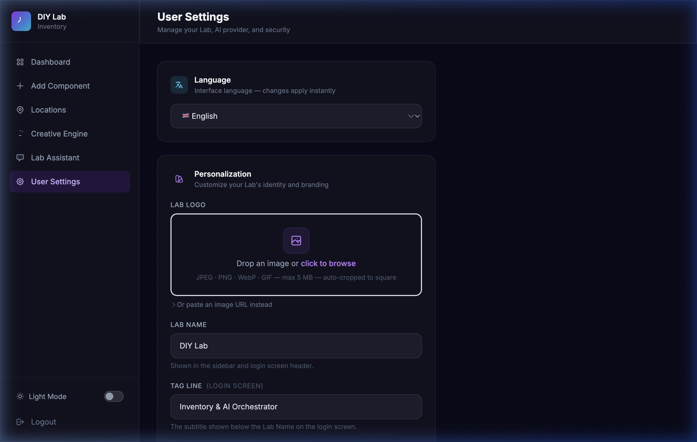
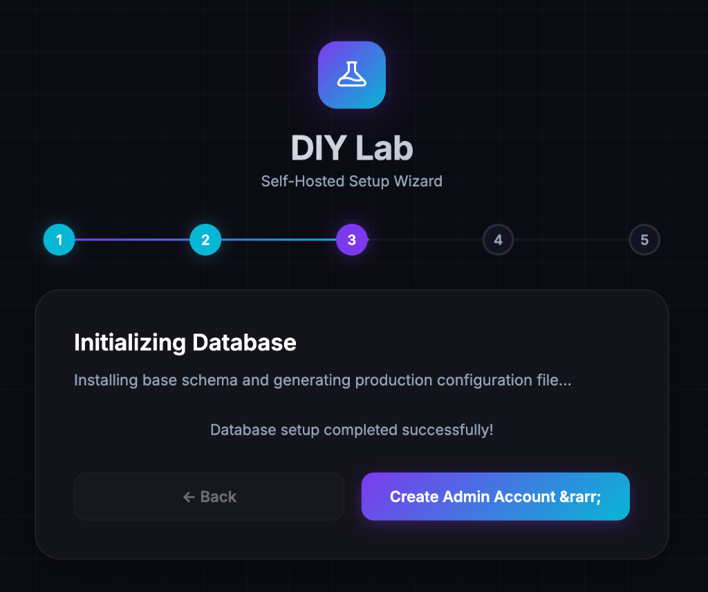
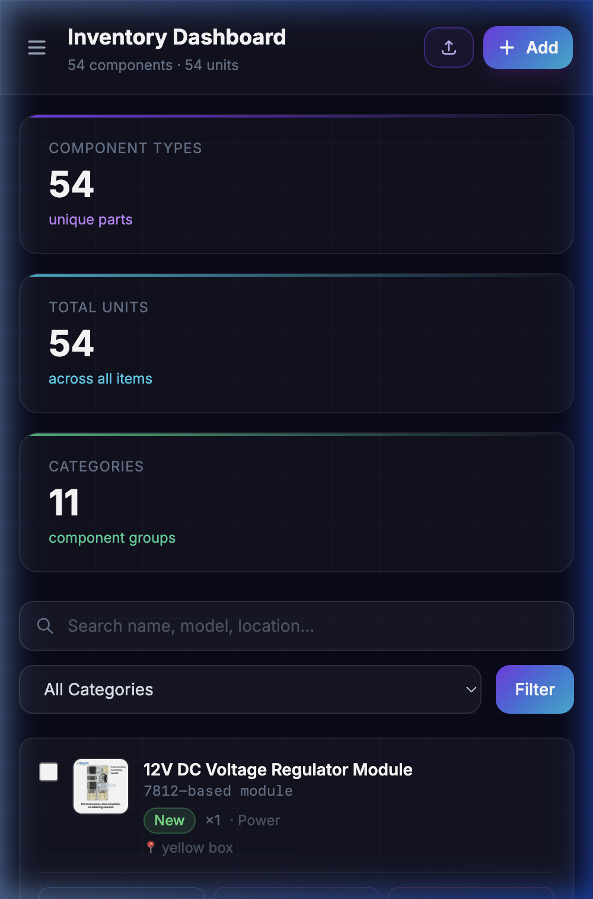
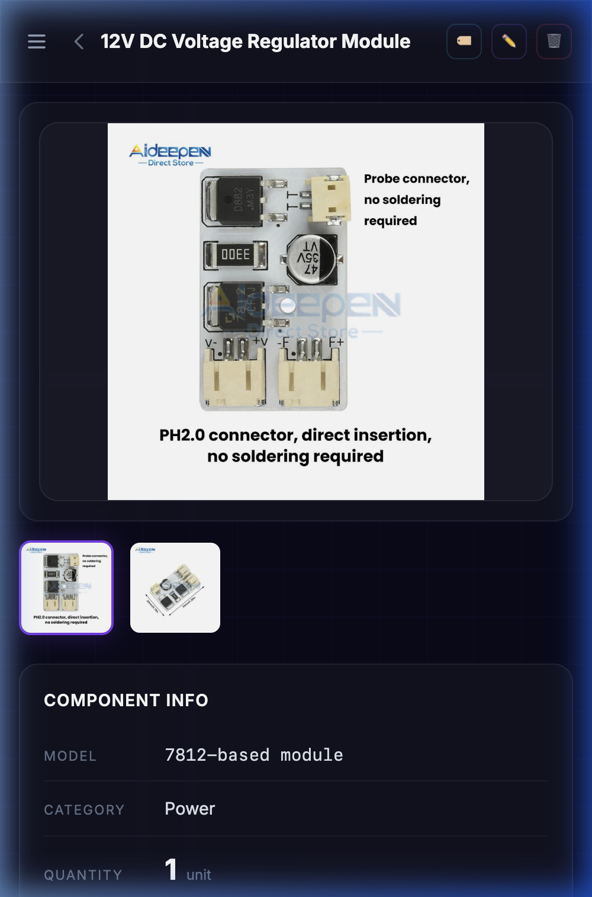
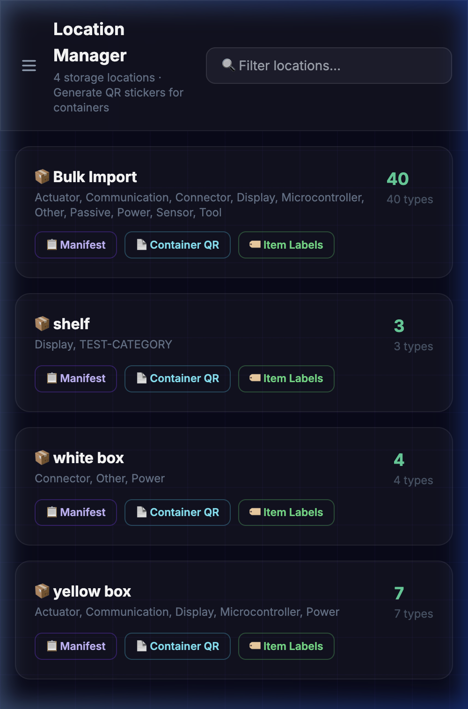
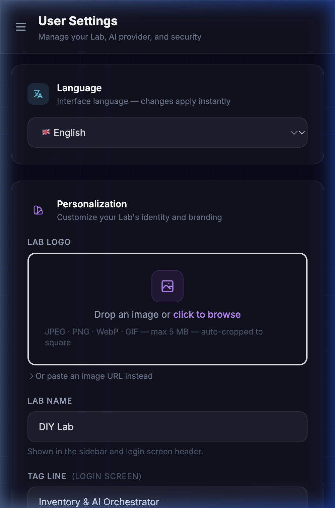

# 🧪 DIY Lab Inventory & AI Orchestrator

> A self-hosted, AI-powered hardware inventory system for makers, hobbyists, and electronics enthusiasts. Track your components, identify parts from photos, and let AI generate project ideas from your actual stock.


---

## 📖 Table of Contents

- [Overview](#-overview)
- [Documentation Dashboard](#️-documentation-dashboard)
- [Screenshots](#-screenshots)
- [Tech Stack](#-tech-stack)
- [Quick Start Installation & Setup Wizard](#-quick-start-installation--setup-wizard)
- [Production Packaging](#-production-packaging)
- [Deployment to a Live Server](#-deployment-to-a-live-server)
- [Security Notes](#-security-notes)
- [Contributing](#-contributing)
- [License](#-license)

---

## 🔬 Overview

The **DIY Lab Inventory & AI Orchestrator** is a lightweight, self-hosted web application that turns the chaos of a maker's lab into a structured, searchable, AI-enhanced database.

Instead of spreadsheets or sticky notes, you get:
- A **visual inventory dashboard** with photos, specs, and location tracking.
- **AI auto-identification** — drop a photo of a component and the AI fills in the name, model, and specs.
- A **Creative Engine** that analyses your actual stock and suggests 5 buildable projects with shopping links for missing parts.
- **AI-generated blueprints** with step-by-step wiring guides and production-ready code.
- A **Lab Assistant chatbot** that knows exactly what components you own.

Everything runs locally on your machine or VPS. No subscriptions, no third-party cloud data locks — just PHP, MySQL, and your own AI API key.

---

## 🗺️ Documentation Dashboard

Use these links to browse the specialized guides and documentation sections:

| Document | Description | Link |
| :--- | :--- | :--- |
| ✨ **Features** | Complete specifications of translations (i18n), custom branding, AI, bulk imports, etc. | [View Features](docs/features.md) |
| 📋 **Usage Guide** | Daily workflow: adding components, bulk imports, printing labels, manifests, and container manager. | [View Usage Guide](docs/usage-guide.md) |
| 🔑 **API Key Setup** | Free Google AI Studio keys vs paid Cloud Console setup and OpenAI GPT-4o setup. | [View API Key Setup](docs/api-keys.md) |
| 🗂️ **File Map** | Repository folder structure and the role of all 70+ files. | [View File Map](docs/file-map.md) |
| 🐛 **Troubleshooting** | Solutions for database connection, upload size limits, cURL, GD, and vision errors. | [View Troubleshooting](docs/troubleshooting.md) |
| 🌐 **Deployment Guide** | VPS configuration (DigitalOcean/Hetzner), SSL setup, DirectAdmin/cPanel, and Apache files. | [View DEPLOYMENT.md](DEPLOYMENT.md) |

---

## 📸 Screenshots

> The app uses a dark glassmorphism aesthetic with an electric purple + cyan gradient palette. A light mode is also available via the sidebar toggle. Lab name, logo, and tagline are fully customisable.

<details>
<summary><b>📷 Expand Dashboard & Chat UI Screenshots</b></summary>
<br>

### Login Screen


### Inventory Dashboard


### Location Manager


### Bulk Import Hub


### Creative Engine — Generated Project Ideas


### Lab Assistant Chat


### Item Detail View


### User Settings


### Setup Wizard


</details>

<details>
<summary><b>📱 Expand Mobile View Screenshots (iPhone 14)</b></summary>
<br>

| Dashboard | Item Detail |
|:---------:|:-----------:|
|  |  |

| Location Manager | User Settings |
|:----------------:|:-------------:|
|  |  |

</details>

---

## 🛠 Tech Stack

<details>
<summary><b>⚙️ Expand Tech Stack Specification</b></summary>
<br>

| Layer | Technology |
|-------|-----------|
| **Backend** | PHP 8.0+ (vanilla, no framework) |
| **Database** | MySQL 8.0+ / MariaDB |
| **Frontend** | HTML5, Vanilla JavaScript, Tailwind CSS v3 (pre-built, local) + custom `assets/app.css` (theme tokens, light-mode overrides, WCAG 2.1 AA contrast) |
| **Fonts** | Google Fonts — Inter, JetBrains Mono |
| **Markdown** | marked.js (CDN) — for blueprint rendering |
| **AI Providers** | Google Gemini 2.5 Flash · OpenAI GPT-4o |
| **Image Storage** | Local filesystem (`uploads/` directory) — component photos auto-resized to 1200px max; logo uploads stored in `uploads/logo/` as 256×256 px JPEG |
| **Image Processing** | PHP GD (built-in) — JPEG, PNG, WebP, GIF input; JPEG output. `imagedestroy()` removed for PHP 8.5 compatibility (no-op since 8.0). |
| **HTTP Client** | PHP cURL (built-in) |

</details>

---

## 🚀 Quick Start Installation & Setup Wizard

The DIY Lab Inventory & AI Orchestrator features a web-based setup wizard (similar to WordPress) that automatically validates prerequisites, sets up database schemas, and configures admin credentials.

### 1. Prerequisites
Ensure you have PHP 8.0+ and MySQL 8.0+ (or MariaDB) installed on your system.

* **macOS (Homebrew):** `brew install php mysql` and `brew services start mysql`
* **Linux (Ubuntu):** `sudo apt update && sudo apt install php php-mysql php-curl php-gd php-mbstring mysql-server -y`
* **Windows:** Start Apache and MySQL via [XAMPP](https://www.apachefriends.org/).

### 2. Clone the Repository
```bash
git clone https://github.com/Philusha1983/diy-inventory.git
cd diy-inventory
```

### 3. Start the PHP Built-in Server
```bash
php -c php.ini -S localhost:8080
```
*(Always run with `-c php.ini` to apply the raised 25MB file upload limit).*

### 4. Run the Setup Wizard
Open your web browser and navigate to:
👉 **`http://localhost:8080`**

Since the application is not yet configured, you will be automatically redirected to the Setup Wizard at `/install/index.php`. Follow the interactive screens to connect your database and configure your admin credentials.

---

## 🗄️ Manual Database Setup (Fallback)

<details>
<summary><b>💾 Click to view manual setup instructions (if wizard fails or folders are read-only)</b></summary>
<br>

**1. Create the Database**
Log into MySQL and execute:
```sql
CREATE DATABASE diy_lab_db CHARACTER SET utf8mb4 COLLATE utf8mb4_unicode_ci;
```

**2. Import the Schema**
```bash
mysql -u root -p diy_lab_db < schema.sql
```

**3. Manually Create `config.php`**
Create `config.php` in the root folder of the project with the following contents:
```php
<?php
define('DB_HOST', 'localhost');
define('DB_NAME', 'diy_lab_db');
define('DB_USER', 'root');
define('DB_PASS', 'YOUR_DATABASE_PASSWORD');
define('SITE_URL', 'http://localhost:8080');
```

**4. Default Credentials**
Login with password **`1234`**, and immediately change the password via **User Settings → Change Lab Password** to encrypt it securely in the database.

</details>

---

## 📦 Production Packaging

To prepare a production package of the application, run the packaging utility script from your terminal:

```bash
php package.php
```

The script will scan the codebase and create a clean `diy-inventory.zip` in the root folder, automatically excluding development modules, logs, local configurations, and test files while maintaining folder structures.

---

## 🌐 Deployment to a Live Server

A full VPS and shared hosting deployment guide is available in **[DEPLOYMENT.md](DEPLOYMENT.md)**. 

---

## 🔒 Security Notes

<details>
<summary><b>🛡️ Click to expand the Security Matrix</b></summary>
<br>

| Risk | Mitigation |
|------|-----------|
| Weak password | Set a strong password during installation, or change it via **User Settings → Change Lab Password** — no file editing needed |
| Password storage | Passwords are hashed with **`PASSWORD_BCRYPT`** via PHP's `password_hash()` and verified with `password_verify()` — never stored as plaintext |
| API key exposure | Keys are stored in the DB, not in files. Never commit `db.php` or `config.php` with credentials to a public repo. |
| File upload abuse | Image MIME types verified; all uploads are re-encoded through PHP GD, stripping any embedded malicious data. |
| SQL injection | All database queries use **PDO prepared statements** throughout. |
| Session hijacking | Sessions are PHP-native. Use HTTPS in production to prevent interception. |

</details>

---

## 🤝 Contributing

Contributions are welcome! Please read **[CONTRIBUTING.md](CONTRIBUTING.md)** for local developer setup, translation frameworks, and pull request requirements.

---

## 📄 License

This project is open-source and available under the [MIT License](LICENSE).

---

<div align="center">
  <strong>Built for makers, by a maker. Happy building! 🔧⚡</strong>
</div>
