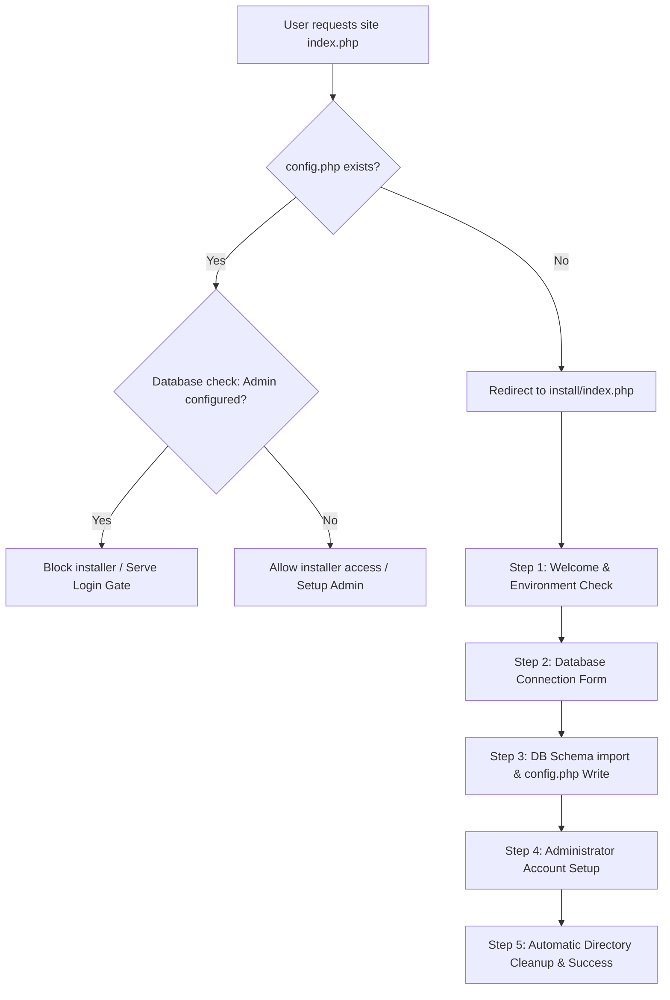

# DIY Inventory Setup Wizard & Production Packaging Documentation

This document describes the design, implementation, security mechanisms, and testing procedures for the DIY Inventory Setup Wizard and Production Packaging tool introduced in v1.2.0.

---

## 🏗 System Architecture & Flow

The installation wizard provides a zero-config, web-based installation experience designed for non-technical users who upload files via FTP or File Manager. It automates environment diagnostics, database configuration, schema seeding, and administrative setup.



---

## 📂 Component Specification

### 1. Application Entrypoint Hook (`db.php`)
[db.php](file:///Users/philipsl/Desktop/diy%20inventory/db.php) acts as the bootstrapper for all database-backed pages. It contains the following routing rules:
- **Redirection**: If `config.php` is missing, the script halts execution and redirects the client to `install/index.php`.
- **AJAX/API Isolation**: If the request is determined to be an AJAX/API request (e.g. `accept: application/json` header, or containing `_api` or `_worker` in the URL), the script returns a clean `503 Service Unavailable` JSON response instead of performing a redirect, preventing broken UI loops.

### 2. Setup Wizard Suite (`install/index.php`)
[install/index.php](file:///Users/philipsl/Desktop/diy%20inventory/install/index.php) is a standalone, self-contained installation page built with vanilla PHP, CSS, and modern interactive JavaScript.

#### Security & Access Restrictions:
- If `config.php` exists and the database has an established `admin_username` in the settings table, the installer immediately blocks execution and redirects the client to the login screen (`/index.php`). This prevents unauthorized reconfiguration of active installations.
- If `config.php` exists but no administrator is configured (e.g. the installation failed midway), it allows access to complete the admin setup step.

#### Interactive Wizard Steps:
1. **Step 1: Environment Check**:
   - Checks that the server runs PHP >= 8.0.0.
   - Validates that critical extensions are installed: `pdo`, `pdo_mysql`, `mbstring`, `curl`, and `gd`.
   - Validates write permissions for the project root (needed to write `config.php`) and write permissions for the `uploads/` and `uploads/logo/` directories.
2. **Step 2: Database Credentials**:
   - Collects database host, database name, database user, and database password.
   - Provides an **AJAX "Test Connection"** button that lets the user verify database credentials without reloading the page or saving broken settings.
3. **Step 3: Database & Schema Installation**:
   - Automatically attempts to create the database if it doesn't exist (if the MySQL user has privilege to do so).
   - Seeds the database by executing the SQL statements inside `schema.sql`.
   - Generates and writes the `config.php` file based on the template. If the root directory is not writeable, it displays a manual copy-paste fallback screen.
4. **Step 4: Administrator Account**:
   - Collects the admin password and tagline/branding preferences.
   - Stores the admin password securely using `password_hash($password, PASSWORD_BCRYPT)`.
5. **Step 5: Completion & Cleanup**:
   - During the final admin creation request, the script automatically attempts to disable itself by renaming the `install/` directory to `install_disabled_[random_hex]`.
   - Renders a safety warning if the folder renaming fails due to server directory permissions, instructing the user to manually rename or delete the folder via FTP.

#### Diagnostics & Troubleshooting logs:
- Setup failures are logged to `install/install_debug.log` with a timestamped traceback.
- **Sensitive Value Masking**: The logger scans tracebacks, queries, and POST parameters, replacing passwords (like database passwords, admin passwords, and password confirms) with `[MASKED]` placeholder strings to prevent leakage of credentials.
- When an AJAX step fails, a scrollable traceback container renders directly inside the UI cards for quick troubleshooting.

### 3. Production Packaging Script (`package.php`)
[package.php](file:///Users/philipsl/Desktop/diy%20inventory/package.php) is a script that packages the source code into a clean production ZIP archive (`diy-inventory.zip`).
- **Exclusion Filters**: Excludes internal developer files, VCS metadata (`.git`, `.github`), SQLite databases (`*.db`, `inventory.db`), local configuration files (`config.php`, `db.php`), error logs (`*.log`), and node_modules.
- **Directory Preservation**: The script explicitly preserves the directory structure for empty folders `uploads/` and `uploads/logo/`, ensuring they exist in the production package so permission diagnostics can run immediately after upload.
- **Execution**: Run from terminal:
  ```bash
  php package.php
  ```

### 4. Setup Wizard Test Suite (`tests/install_validation_test.php`)
A PHP CLI-based automated validation test suite validating critical installer routines.
- **Environment Checks**: Validates PHP version parsing comparisons (e.g. 8.2.0 meets 8.0.0 requirement, 7.4.29 fails).
- **Config Generator**: Checks templating outputs for database constants, site URLs, and quote escaping.
- **Sensitive Masking Audit**: Asserts that database passwords and administrator passwords are correctly stripped from error logs and diagnostic stack traces, while non-sensitive parameters (host, user) are preserved.
- **DB Connection Mocking**: Verifies connection errors are handled and reported gracefully as human-readable error messages.
- **Execution**: Run from terminal:
  ```bash
  php tests/install_validation_test.php
  ```

---

## 🔒 Security Best Practices

1. **Installer Access Control**: The installer cannot be run once `config.php` has been configured and an admin user is registered.
2. **Directory Renaming**: Renaming `install/` to `install_disabled_[hex]` removes the endpoint from default URLs.
3. **Password Security**: Administrative credentials use BCRYPT hashing (cost factor 10) instead of plain-text or weak hashes.
4. **Log Cleansing**: Sensitive database passwords and admin passwords are automatically replaced with `[MASKED]` in `install_debug.log`.
